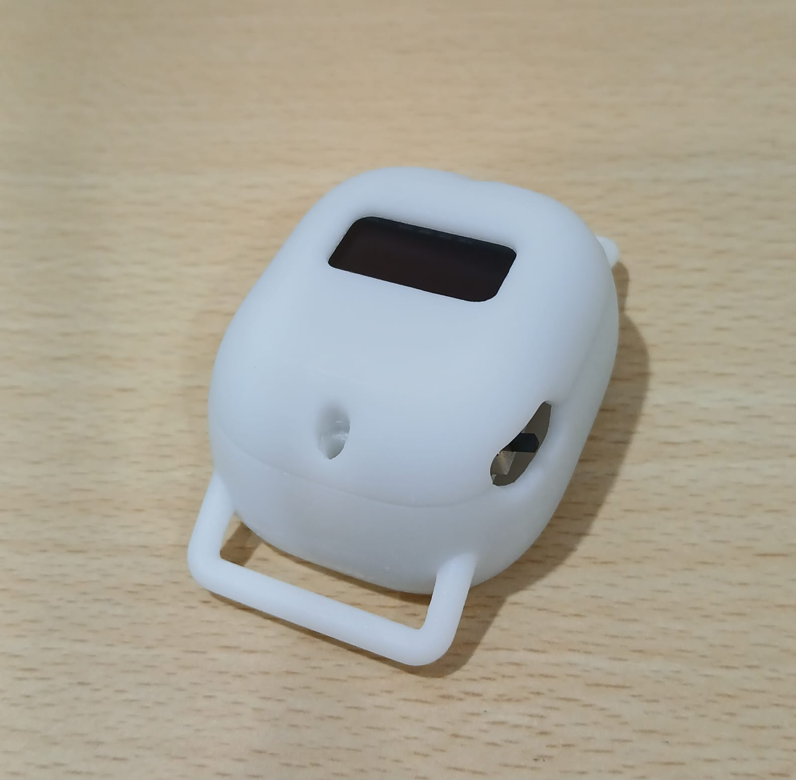

# GaitTracker
GaitTracker is a wearable device in development, for anaylsing and quantifying human gait parameters.
a# GaitTracker

### An IMU-Based Wearable System for Quantitative Gait Analysis

GaitTracker is a low-cost, wearable system developed for quantitative
gait analysis using inertial sensing. The system combines custom
embedded hardware, on-device signal processing, local data logging,
and a companion mobile application to capture and analyze
spatiotemporal gait parameters.

  

## Overview

Conventional quantitative gait-analysis systems often rely on
specialized laboratory equipment such as pressure mats and optical
motion-capture systems. GaitTracker was developed as a compact and
accessible alternative for objective gait assessment in clinical
and rehabilitation environments.

The system uses synchronized wearable sensors mounted on the lower
legs to capture gait independently for each limb, enabling analysis
of inter-limb asymmetry and compensatory gait patterns.

## System

The final GaitTracker V3.0 system incorporates:

- ESP32-S3 microcontroller
- ICM-42688-P 6-axis IMU
- Local MicroSD data storage
- Real-Time Clock (RTC)
- OLED status display
- Battery-powered operation
- Dual-leg sensor configuration

The V3.0 System-on-Board represents a substantial miniaturization
over the initial prototype while retaining the sensing and processing
capabilities required for clinical data acquisition.

## Signal Processing

The GaitTracker processing pipeline converts raw inertial measurements
into gait events and spatiotemporal parameters.

The system extracts parameters including:

- Cadence
- Gait cycle duration / stride time
- Stance phase
- Swing phase
- Inter-limb asymmetry

The processing pipeline was designed for low computational overhead
and edge execution on the wearable device.

## Validation

The GaitTracker algorithm was evaluated against the
Scikit-Digital-Health (SKDH) framework.

Comparative analysis included spatiotemporal gait parameters and
Bland-Altman analysis to evaluate agreement between the two methods.

The system was also deployed in clinical settings to study both
healthy gait and pathological gait patterns.

## Clinical Evaluation

The system was evaluated across healthy and pathological cohorts,
including cases involving:

- Unilateral knee osteoarthritis
- Calcaneal spurs
- Fracture rehabilitation
- Healthy gait baselines

The dual-leg configuration enabled independent analysis of each limb
and characterization of inter-limb asymmetries and compensatory
walking strategies.

## Mobile Application

A companion mobile application was developed to provide a clinician-
facing interface for the GaitTracker system.

The application supports:

- Device discovery and pairing
- Hardware diagnostics
- Network configuration
- Clinical session management
- Historical session access
- Report generation
- Dataset export

The application uses Bluetooth Low Energy for device discovery and
initial configuration, followed by Wi-Fi/WebSockets for higher-
bandwidth communication.

## Documentation

The complete project report is available here:

[Read the GaitTracker Project Report](docs/GaitTracker_Thesis.pdf)

## Repository Scope

This repository contains selected documentation and photographs
of the GaitTracker project.

The source code, firmware implementation, processing scripts,
clinical datasets, and other implementation details are not included
in this repository.

## License

See `LICENSE` for the terms governing the use of materials in
this repository.
